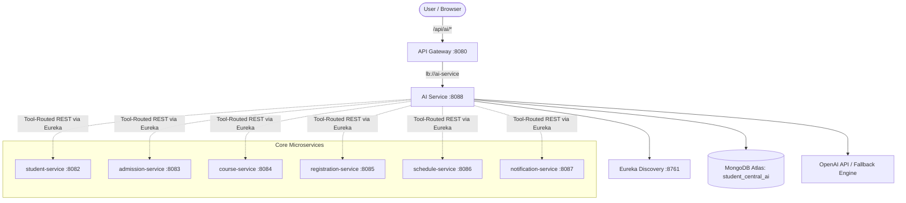

# AI & Agentic Intelligence Layer Architecture

## Overview
Phase 12 introduces a dedicated AI & Agentic Intelligence microservice (`ai-service`, port `8088`) designed as an enhancement layer to the Student Central Smart Campus platform.

## Architectural Tenets
1. **Separation of Concerns**: Deterministic business logic (prerequisites, credit caps, seat reservation, schedule conflict checks) is 100% owned by backend core microservices. AI is an advisory and conversational orchestration layer.
2. **Graceful Degradation**: If `OPENAI_API_KEY` is not set or OpenAI is unreachable, the system automatically uses the internal `RuleBasedFallbackEngine` grounded in verified student records. The core university operations never halt or fail.
3. **Dedicated Database**: `ai-service` connects directly only to `student_central_ai` (`ai_conversations`, `ai_recommendations`, `ai_insights`, `ai_audit_logs`). No cross-service database access.
4. **Agentic Tool Router**: The multi-turn chatbot uses an Agent Tool Router equipped with 8 specialized tools to dynamically fetch context on behalf of the authenticated student.
5. **Security & Rate Limiting**:
   - Token bucket rate limiter: max 20 requests per user per hour.
   - Prompt injection sanitization: detects and neutralizes adversarial override instructions.
   - Data isolation: students can only access their own academic records.
